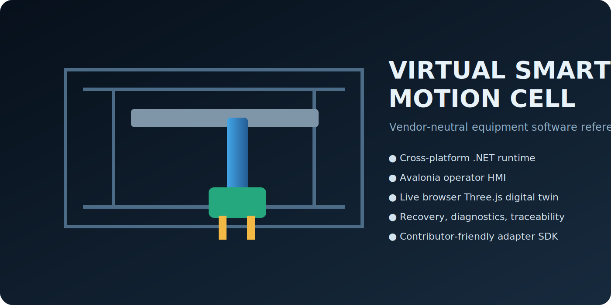
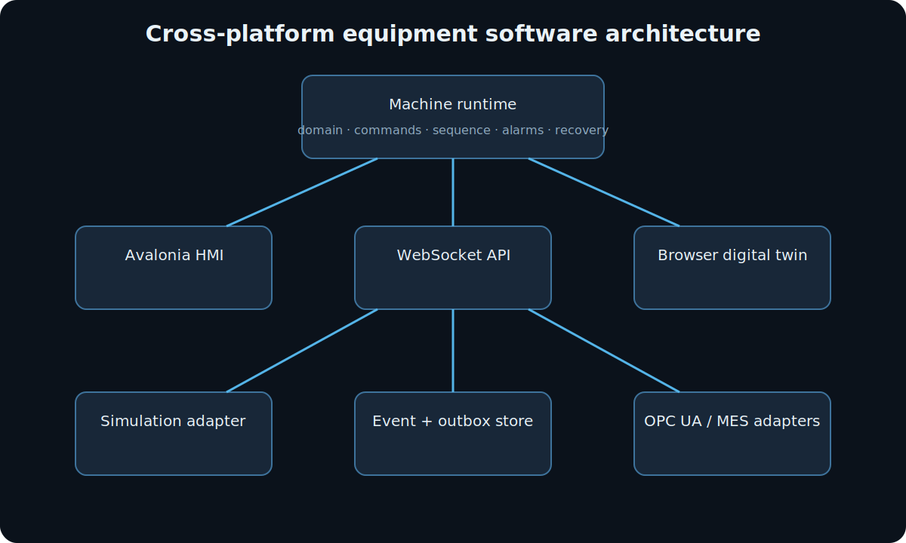

# Virtual Smart Motion Cell

[](https://github.com/parthoece/virtual-smart-motion-cell/actions/workflows/ci.yml)
[](https://github.com/parthoece/virtual-smart-motion-cell/actions/workflows/codeql.yml)
[](https://securityscorecards.dev/viewer/?uri=github.com/parthoece/virtual-smart-motion-cell)
[](LICENSE)
[](docs/platform-support.md)



Virtual Smart Motion Cell is an open-source reference implementation of a software-defined industrial machine cell.

It combines a headless .NET machine runtime, simulated motion control, an Avalonia operator HMI, a Three.js digital twin, OPC UA, MES integration, production traceability, observability, and restart recovery. The complete system runs without physical equipment on Windows, Linux, and macOS.

> **Safety boundary:** This project is a simulation and software-architecture demonstrator. It is not a safety controller, certified control system, or interface for operating physical machinery.

## Features

* Headless ASP.NET Core machine runtime
* Modular-monolith and ports-and-adapters architecture
* Manual, Automatic, Maintenance, Recovery, and Offline modes
* Simulated X/Y motion with PID control, motion profiles, limits, homing, and following-error monitoring
* Deterministic replay and fault-injection motion adapters
* Serialized command processing with structured rejection reasons
* Interlocks, alarms, pause, controlled stop, abort, checkpoints, and recovery workflows
* Cross-platform Avalonia operator HMI
* Three.js browser-based digital twin with live WebSocket updates
* Production orders, parts, cycles, recipes, traceability, OEE, and alarm history
* Durable, idempotent manufacturing-integration outbox
* HTTP MES simulator with configurable outages and latency
* Read-only OPC UA simulation server
* Health endpoints, Prometheus metrics, OpenTelemetry, structured logs, and correlation IDs
* Cross-platform CI, release artifacts, SBOMs, checksums, and attestations

The mapping between project claims, source code, tests, and documentation is maintained in the [portfolio evidence matrix](docs/portfolio-evidence-matrix.md).

## Quick start

### Prerequisites

* .NET SDK `10.0.301`
* Node.js 22 when rebuilding the browser viewer
* Python 3.11+ for the research benchmark and retained numerical reference model
* Docker Desktop or Docker Engine for the container demo

### Build on Windows

From PowerShell:

```powershell
Set-ExecutionPolicy -Scope Process -ExecutionPolicy Bypass

dotnet restore VirtualSmartMotionCell.sln
dotnet build VirtualSmartMotionCell.sln -c Release
```

The repository also includes a Windows startup script:

```powershell
Set-ExecutionPolicy -Scope Process -ExecutionPolicy Bypass
.\start-complete.ps1
```

### Build on Linux or macOS

```bash
dotnet restore VirtualSmartMotionCell.sln
dotnet build VirtualSmartMotionCell.sln -c Release
```

### Start the MES simulator

```bash
dotnet run --project tools/VirtualSmartMotionCell.MesSimulator
```

### Start the machine runtime

In a second terminal:

```bash
dotnet run --project src/VirtualSmartMotionCell.Api
```

Open:

```text
http://localhost:8080
```

The runtime exposes:

| Interface              | Default endpoint                     |
| ---------------------- | ------------------------------------ |
| Browser viewer         | `http://localhost:8080`              |
| REST API               | `http://localhost:8080/api/v1`       |
| WebSocket state stream | `ws://localhost:8080/ws/state`       |
| Liveness               | `http://localhost:8080/health/live`  |
| Readiness              | `http://localhost:8080/health/ready` |
| Prometheus metrics     | `http://localhost:8080/metrics`      |
| OPC UA                 | `opc.tcp://localhost:4840/vsmc`      |

### Start the operator HMI

In another terminal:

```bash
dotnet run --project src/VirtualSmartMotionCell.Hmi
```

The HMI connects to `http://localhost:8080` by default.

Override the endpoint with:

```powershell
$env:VSMC_ENDPOINT = "http://localhost:18080"
dotnet run --project src/VirtualSmartMotionCell.Hmi
```

On Linux or macOS:

```bash
VSMC_ENDPOINT=http://localhost:18080 \
dotnet run --project src/VirtualSmartMotionCell.Hmi
```

### Run a cycle

Use the HMI or browser interface to:

1. Initialize the machine.
2. Home both axes.
3. Load or accept a production order.
4. Select Automatic mode.
5. Start the machine.

On Linux or macOS, the demo script performs the sequence automatically:

```bash
./scripts/run-demo.sh
```

## Container demo

Build and start the runtime and MES simulator:

```bash
docker compose up --build
```

Open:

```text
http://localhost:8080
```

Wait until both services report ready before starting a cycle.

### Change the host port

When port `8080` is unavailable, create a `.env` file in the repository root:

```dotenv
VSMC_RUNTIME_PORT=18080
```

Start the containers again:

```bash
docker compose up --build
```

Open:

```text
http://localhost:18080
```

The runtime continues to listen on port `8080` inside the container; only the host-side port changes.

## Architecture



```mermaid
%%{
  init: {
    "themeVariables": {
      "fontSize": "19px"
    },
    "flowchart": {
      "useMaxWidth": true,
      "nodeSpacing": 65,
      "rankSpacing": 75,
      "diagramPadding": 12
    }
  }
}%%
flowchart TB
    HMI[Avalonia operator HMI] --> API[ASP.NET Core API]
    Twin[Three.js digital twin] --> WS[WebSocket state stream]

    API --> Bus[Bounded command bus]
    Bus --> Runtime[Headless machine runtime]
    Runtime --> Domain[Machine domain and sequences]

    Domain --> Motion[Motion system abstraction]
    Motion --> Sim[Simulation adapter]
    Motion --> Replay[Replay adapter]
    Motion --> Fault[Fault-injection adapter]

    Runtime --> Stores[Production data and durable outbox]
    Runtime --> OPC[OPC UA simulation server]
    Runtime --> MES[HTTP MES integration]
    Runtime --> OTel[Logs, metrics, and traces]
    Runtime --> WS does not depend on Avalonia, Three.js, HTTP, file storage, OPC UA, or a motion-controller vendor. External systems are connected through application ports and infrastructure adapters.

### Main runtime flow

1. Commands enter through REST, the HMI, the MES poller, or internal services.
2. A bounded command bus serializes command execution.
3. `MachineCoordinator` evaluates modes, interlocks, sequences, and transitions.
4. The selected `IMotionSystem` implementation advances the machine model.
5. Runtime services persist events, production records, alarms, and checkpoints.
6. Completed cycles enter the manufacturing outbox.
7. The outbox worker delivers results through the configured MES gateway.
8. State snapshots are published through REST, WebSocket, OPC UA, and telemetry.

## Motion adapters

The runtime supports several motion implementations behind `IMotionSystem`:

* **Simulation adapter:** Runs the complete machine without hardware.
* **Replay adapter:** Replays recorded position and state data.
* **Fault-injection adapter:** Adds deterministic bus, drive, following-error, and motion faults.
* **Contributor adapters:** Can be implemented with the Adapter SDK without changing the machine domain.

See [adapter development](docs/adapter-development.md).

## Production and integration data

The runtime persists operational data under its configured data directory.

Typical data includes:

```text
events.jsonl
checkpoint.json
production/
  orders.jsonl
  parts.jsonl
  cycles.jsonl
  traceability.jsonl
alarms/
  history.jsonl
outbox/
  pending/
  delivered/
```

JSONL journals contain one compact JSON object per line. Outbox messages remain in `pending` until a gateway reports successful or idempotent delivery, after which they move to `delivered`.

The data directory can be overridden with:

```powershell
$env:VSMC_DATA_DIR = "artifacts/runtime-data"
```

or:

```bash
VSMC_DATA_DIR=artifacts/runtime-data
```

## MES integration

The repository includes an HTTP MES simulator that supports:

* Order creation
* Machine order polling
* Idempotent result delivery
* Duplicate-response testing
* Simulated outages
* Configurable response delays

The runtime can use either an HTTP or file-based manufacturing gateway.

Example HTTP configuration:

```text
VSMC_Mes__Mode=Http
VSMC_Mes__BaseUrl=http://127.0.0.1:8090/
VSMC_Mes__PollOrders=true
VSMC_Mes__PollIntervalMilliseconds=250
```

The outbox ensures completed-cycle results can be retried without creating duplicate MES records.

## Recovery model

The runtime writes checkpoints while the machine is active. After an interrupted cycle, it can enter `RecoveryRequired` instead of silently resuming motion.

Supported recovery decisions include:

* Discard the interrupted part
* Rehome before continuing
* Resume in simulation-only scenarios
* Clear recovery state after reaching a safe condition

See the recovery documentation and architecture decision records under [`docs/`](docs/).

## Research benchmark

The repository includes a machine-fault-first dynamic research benchmark under [`research/`](research/README.md).

The initial environment, `VSMC-DynamicGantry-v1`, supports:

* Dynamic production orders
* Product-specific payloads
* Queues and changeovers
* Maintenance events
* Seeded machine and network conditions
* Synchronized research recording
* Visual experiment inspection

Install and run:

```bash
python -m pip install -e "research[dev]"
vsmc-bench run benchmarks/manifests/machine-fault.yaml --output runs
vsmc-studio --host 127.0.0.1 --port 8090
```

On Windows, `py -3` can be used when the `python` command is unavailable:

```powershell
py -3 -m pip install -e "research[dev]"
```

Generated experiment bundles may include:

* Typed Parquet tables
* CSV compatibility exports
* EtherCAT PCAPNG evidence
* Decoded LRW and CiA 402-style PDO tables
* JSONL logs
* Oracle ground truth
* Multimodal dataset windows
* Metrics
* Provenance metadata
* Checksums

Start with:

* [Research documentation](docs/research/README.md)
* [EtherCAT protocol model](docs/research/ethercat-protocol.md)
* [Final research plan](docs/research/final-research-plan.md)
* [Research questions](docs/research/research-questions.md)
* [Generated sample report](docs/assets/research-sample/index.html)

Cyber-influenced and honeypot research are treated as optional later phases with explicit isolation and safety boundaries.

## Project structure

```text
src/
  VirtualSmartMotionCell.Contracts/
      Commands, events, snapshots, and shared contracts

  VirtualSmartMotionCell.Domain/
      Orders, recipes, alarms, production models, and machine state

  VirtualSmartMotionCell.Control/
      PID control, simulation, replay, and fault adapters

  VirtualSmartMotionCell.Application/
      Machine coordinator, command bus, application ports, and orchestration

  VirtualSmartMotionCell.Infrastructure/
      File stores, checkpoints, production records, outbox, and MES gateways

  VirtualSmartMotionCell.Runtime/
      Hosted loops, state publication, command processing, and MES polling

  VirtualSmartMotionCell.OpcUa/
      Read-only OPC UA simulation server

  VirtualSmartMotionCell.Api/
      REST, WebSocket, health, metrics, telemetry, and browser hosting

  VirtualSmartMotionCell.Hmi/
      Cross-platform Avalonia operator interface

  VirtualSmartMotionCell.AdapterSdk/
      Contributor extension contracts

web/viewer/
    Three.js digital twin

examples/
    Sample equipment adapter

tests/
    Behavioral, integration, and architecture specifications

tools/
    MES simulator and reliability campaign tools

research/
    Dynamic benchmark kernel and Experiment Studio

benchmarks/
    Versioned manifests, schemas, and reference-result policy

datasets/
    Dataset release guidance and conformance fixtures

reference/python-simulator/
    Numerical reference model

docs/
    Architecture, ADRs, research material, evidence, and contributor guides
```

## Testing

### .NET build and specifications

```bash
dotnet build VirtualSmartMotionCell.sln -c Release

dotnet run \
  --project tests/VirtualSmartMotionCell.Specs \
  --configuration Release \
  --no-build

dotnet run \
  --project tests/VirtualSmartMotionCell.IntegrationSpecs \
  --configuration Release \
  --no-build
```

PowerShell equivalent:

```powershell
dotnet build VirtualSmartMotionCell.sln -c Release

dotnet run `
    --project tests/VirtualSmartMotionCell.Specs `
    --configuration Release `
    --no-build

dotnet run `
    --project tests/VirtualSmartMotionCell.IntegrationSpecs `
    --configuration Release `
    --no-build
```

### Browser viewer

```bash
npm ci --prefix web/viewer
npm run check --prefix web/viewer
npm run build --prefix web/viewer
```

Vite may report a chunk-size warning when the main bundle exceeds its default warning threshold. The warning does not indicate a failed build.

### Numerical reference model

```bash
python -m pip install -e "reference/python-simulator[dev]"
pytest -q reference/python-simulator/tests
```

Windows launcher form:

```powershell
py -3 -m pip install -e "reference/python-simulator[dev]"
py -3 -m pytest -q reference/python-simulator/tests
```

### Research benchmark

```bash
python -m pip install -e "research[dev]"
pytest -q research/tests
vsmc-bench validate benchmarks/manifests/machine-fault.yaml
```

### Repository checks

```bash
python scripts/check_repo.py
```

On Windows:

```powershell
py -3 scripts/check_repo.py
```

## Continuous integration

CI validates the project on Windows, Ubuntu, and macOS.

The workflows cover:

* .NET restore and Release builds
* Behavioral and integration specifications
* Viewer dependency checks and production builds
* Repository consistency checks
* End-to-end runtime and MES startup
* REST commands and state transitions
* WebSocket state publication
* OPC UA TCP availability
* MES order assignment
* Idempotent outbox result delivery
* Security scanning and dependency review

A platform is described as **tested** only after its CI job is green.

See [platform support](docs/platform-support.md) and [cross-platform releases](docs/cross-platform-release.md).

## Releases

Release workflows publish self-contained builds for:

* Windows x64
* Windows ARM64
* Linux x64
* Linux ARM64
* macOS x64
* macOS ARM64

Release output may also include:

* SBOMs
* SHA checksums
* Build provenance
* Attestations

## Demo walkthrough

A complete demonstration can cover:

1. Start the runtime, HMI, viewer, and MES simulator.
2. Submit an unsafe command and inspect the rejection response.
3. Initialize and home the simulated machine.
4. Load an order and complete a pick–inspect–place cycle.
5. Pause and resume during a cycle.
6. Perform a controlled stop and abort.
7. Inject a guard, bus, drive, or following-error fault.
8. Inspect alarms and interlock state.
9. Disconnect the viewer and verify the runtime continues independently.
10. Put the MES simulator offline and complete another cycle.
11. Inspect the pending outbox message.
12. Restore MES connectivity and verify idempotent delivery.
13. Restart during an active cycle and inspect recovery options.
14. Browse machine state through OPC UA.
15. Inspect correlated logs, metrics, and traces.

See the [portfolio demo](docs/portfolio-demo.md) for a guided version.

## Documentation

Architecture and design:

* [Architecture overview](docs/)
* [Portfolio evidence matrix](docs/portfolio-evidence-matrix.md)
* [Current limitations](docs/current-limitations.md)
* [Platform support](docs/platform-support.md)
* [Cross-platform releases](docs/cross-platform-release.md)

Contributors:

* [Contributing guide](CONTRIBUTING.md)
* [Contributor quickstart](docs/contributor-quickstart.md)
* [Adapter development](docs/adapter-development.md)
* [Good first issues](docs/good-first-issues.md)
* [Governance](GOVERNANCE.md)
* [Compatibility policy](COMPATIBILITY.md)

Research:

* [Research overview](docs/research/README.md)
* [EtherCAT protocol model](docs/research/ethercat-protocol.md)
* [Final research plan](docs/research/final-research-plan.md)
* [Research questions](docs/research/research-questions.md)

## Contributing

Contributions are welcome.

The project favors changes that:

* Preserve separation between the machine domain and external technologies
* Add behavior through explicit ports and adapters
* Include deterministic tests
* Keep simulation usable without proprietary hardware or software
* Maintain cross-platform behavior
* Document externally visible configuration and behavior

Before opening a pull request:

```bash
dotnet build VirtualSmartMotionCell.sln -c Release
dotnet run --project tests/VirtualSmartMotionCell.Specs -c Release
dotnet run --project tests/VirtualSmartMotionCell.IntegrationSpecs -c Release
npm run check --prefix web/viewer
```

See [CONTRIBUTING.md](CONTRIBUTING.md) for the complete process.

## Current limitations

The project does not claim:

* Hard real-time execution
* Certified functional safety
* Physical-machine commissioning
* OPC UA certification
* Commercial MES conformance
* High-fidelity mechanical physics
* Deterministic timing under a general-purpose operating system

Review [current limitations](docs/current-limitations.md) before adapting the project for operational equipment.

## Security

Report security issues according to the repository’s security policy rather than through a public issue.

Automated security checks include CodeQL, dependency review, OpenSSF Scorecard reporting, and release attestations.

## License

Licensed under the Apache License 2.0.

See [LICENSE](LICENSE) and [NOTICE](NOTICE).
