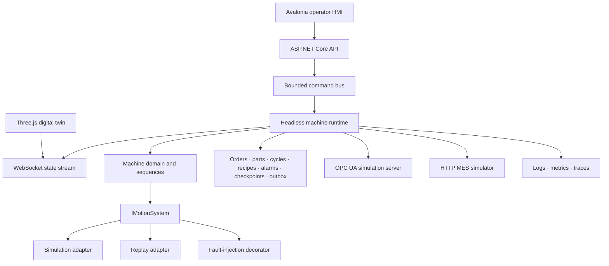

# Virtual Smart Motion Cell

[](https://github.com/YOUR_GITHUB_HANDLE/virtual-smart-motion-cell/actions/workflows/ci.yml)
[](https://github.com/YOUR_GITHUB_HANDLE/virtual-smart-motion-cell/actions/workflows/codeql.yml)
[](https://securityscorecards.dev/viewer/?uri=github.com/YOUR_GITHUB_HANDLE/virtual-smart-motion-cell)
[](LICENSE)
[](docs/platform-support.md)


**Virtual Smart Motion Cell is an open-source, vendor-neutral equipment-software reference architecture for machine control, virtual commissioning, operator HMI, industrial interoperability, manufacturing traceability, observability, and recovery.**

It is designed as a flagship software-architecture portfolio for equipment, automation, PC-based control, industrial HMI, virtual commissioning, motion-control, and smart-manufacturing roles. Every normal and failure scenario is designed to run without physical hardware on Windows, Linux, or macOS; a platform is called tested only after its CI job is green.

> **Safety boundary:** This is a simulation and software-architecture demonstrator. It is not a safety controller, certified control system, or interface for physical machinery.

## What it proves

- a headless .NET machine runtime independent from every UI
- a modular-monolith and ports-and-adapters architecture
- bounded, serialized commands with structured rejection reasons
- Manual, Automatic, Maintenance, Recovery, and Offline modes
- simulated X/Y motion with PID, profiles, limits, homing, and following-error monitoring
- simulation, recorded replay, and deterministic fault-injection motion adapters
- functional interlocks, alarm lifecycle, pause, controlled stop, abort, restart checkpoints, and explicit recovery decisions
- a cross-platform Avalonia operator HMI
- a live Three.js 3D digital twin with recorded replay mode
- orders, parts, cycles, recipe revisions, traceability, OEE, alarm history, and an idempotent integration outbox
- a read-only OPC UA simulation server and an outage-capable HTTP MES simulator
- structured logs, health checks, Prometheus metrics, OpenTelemetry traces/metrics, and correlation IDs
- automated Windows, Linux, and macOS builds and six self-contained release targets
- contributor extension points, governance, security automation, SBOMs, and release attestations

The complete claim-to-code mapping is in the [portfolio evidence matrix](docs/portfolio-evidence-matrix.md).


## Research benchmark extension

The repository now includes a runnable **machine-fault-first dynamic research benchmark** in [`research/`](research/README.md). The first environment, `VSMC-DynamicGantry-v1`, adds dynamic orders, product-specific payloads, queues, changeovers, maintenance, seeded machine and network conditions, synchronized research recording, and a visual Experiment Studio.

```bash
python -m pip install -e "research[dev]"
vsmc-bench run benchmarks/manifests/machine-fault.yaml --output runs
vsmc-studio --host 127.0.0.1 --port 8090
```

The generated experiment bundle contains typed Parquet tables, compatibility CSV exports, wire-format EtherCAT PCAPNG evidence, decoded LRW/CiA 402-style PDO tables, JSONL logs, separate oracle ground truth, multimodal dataset windows, metrics, provenance, and checksums. The browser and CLI execute the same versioned manifest.

Start with the [research documentation](docs/research/README.md), [EtherCAT protocol model](docs/research/ethercat-protocol.md), [final research plan](docs/research/final-research-plan.md), and [research questions](docs/research/research-questions.md). A verified generated example is available in the [research sample report](docs/assets/research-sample/index.html). Cyber-influenced and honeypot research remain optional later phases with explicit isolation and safety boundaries.

## Architecture at a glance




The machine domain does not depend on Avalonia, Three.js, HTTP, file storage, OPC UA, or a motion-controller vendor. Those dependencies sit behind contracts and adapters.

## Quick start

### Prerequisites

- .NET SDK `10.0.301`
- Node.js 22 when rebuilding the 3D viewer
- Python 3.11+ only for the retained numerical reference model

### 1. Build

```bash
dotnet restore VirtualSmartMotionCell.sln
dotnet build VirtualSmartMotionCell.sln -c Release
```

### 2. Start the simulated MES

```bash
dotnet run --project tools/VirtualSmartMotionCell.MesSimulator
```

### 3. Start the machine runtime and browser viewer

```bash
dotnet run --project src/VirtualSmartMotionCell.Api
```

Open `http://localhost:8080`. The same process exposes REST, WebSocket, health, metrics, and the OPC UA endpoint `opc.tcp://localhost:4840/vsmc`.

### 4. Start the operator HMI

```bash
dotnet run --project src/VirtualSmartMotionCell.Hmi
```

The HMI connects to `http://localhost:8080` by default. Override it with `VSMC_ENDPOINT`.

### 5. Run a cycle

Use the HMI, or run:

```bash
./scripts/run-demo.sh
```

The script initializes, homes, loads a production order, selects Automatic, and starts the virtual cell.

### Container demo

```bash
docker compose up --build
```

Open `http://localhost:8080` after both services report ready.

## Recruiter walkthrough

A focused demonstration should show:

1. Run the headless runtime, Avalonia HMI, Three.js viewer, and MES simulator.
2. Load an order, initialize, home, select Automatic, and complete a pick–inspect–place cycle.
3. Submit an unsafe command and inspect its structured rejection reasons.
4. Pause and resume, then demonstrate controlled stop and abort.
5. Open the guard or inject bus/drive/following-error faults and inspect alarms and interlocks.
6. Disconnect the viewer and verify the machine runtime continues independently.
7. Put the MES offline, complete a cycle, inspect the outbox, restore MES, and verify idempotent delivery.
8. Restart during a cycle and choose discard, rehome, or simulation-only resume from `RecoveryRequired`.
9. Browse the same state through OPC UA and inspect correlated logs, metrics, and traces.
10. Explain how a vendor adapter can replace simulation without changing the domain or HMI.

See the [portfolio demo](docs/portfolio-demo.md) and [recruiter skill map](docs/recruiter-skill-map.md).

## Repository map

```text
src/
  VirtualSmartMotionCell.Contracts/       Immutable commands, snapshots and events
  VirtualSmartMotionCell.Domain/          Orders, recipes, alarms and production models
  VirtualSmartMotionCell.Control/         PID, simulation, replay and fault adapters
  VirtualSmartMotionCell.Application/     Machine coordinator, command bus and ports
  VirtualSmartMotionCell.Infrastructure/  Production stores, checkpoints, outbox and MES gateways
  VirtualSmartMotionCell.Runtime/         Hosted loops, state publication and MES polling
  VirtualSmartMotionCell.OpcUa/           Read-only OPC UA simulation server
  VirtualSmartMotionCell.Api/             REST, WebSocket, health, metrics and OpenTelemetry
  VirtualSmartMotionCell.Hmi/             Cross-platform Avalonia operator interface
  VirtualSmartMotionCell.AdapterSdk/      Contributor extension contracts
web/viewer/                                Bundled Three.js digital twin
examples/                                  Sample equipment adapter
tests/                                     Behavioral, integration and architecture specifications
tools/                                     MES simulator and reliability campaign
research/                                  Dynamic benchmark kernel and visual Experiment Studio
benchmarks/                                Versioned manifests, schemas, and reference-result policy
datasets/                                  Dataset release guidance and small conformance fixtures
reference/python-simulator/                Tested numerical reference model
docs/                                      C4 views, ADRs, research plan, evidence and contributor guides
```

## Testing and releases

```bash
dotnet run --project tests/VirtualSmartMotionCell.Specs -c Release
dotnet run --project tests/VirtualSmartMotionCell.IntegrationSpecs -c Release
npm ci --prefix web/viewer
npm run check --prefix web/viewer
npm run build --prefix web/viewer
python -m pip install -e "reference/python-simulator[dev]"
pytest -q reference/python-simulator/tests
python -m pip install -e "research[dev]"
pytest -q research/tests
vsmc-bench validate benchmarks/manifests/machine-fault.yaml
python scripts/check_repo.py
```

CI performs the .NET build and specifications on Windows, Ubuntu, and macOS. End-to-end CI starts the runtime and MES, tests REST and WebSocket behavior, checks OPC UA TCP availability, and verifies integration delivery. The release workflow publishes self-contained x64 and ARM64 artifacts for all three desktop operating systems, plus SBOMs, checksums, and attestations.

A platform is described as **tested** only after its CI job is green. See [cross-platform release](docs/cross-platform-release.md).

## Open-source contributors

Start with:

- [Contributing guide](CONTRIBUTING.md)
- [Contributor quickstart](docs/contributor-quickstart.md)
- [Adapter development](docs/adapter-development.md)
- [Suggested good first issues](docs/good-first-issues.md)
- [Governance](GOVERNANCE.md)
- [Compatibility policy](COMPATIBILITY.md)

The project favors small, testable adapters and explicit design proposals over changes that couple the domain to one UI, protocol, database, or vendor.

## Current limitations

The project does not claim hard real-time behavior, certified functional safety, physical commissioning, OPC UA certification, commercial MES conformance, or high-fidelity mechanical physics. Review [current limitations](docs/current-limitations.md) before adapting it to operational equipment.

## License

Apache License 2.0. See [LICENSE](LICENSE) and [NOTICE](NOTICE).
