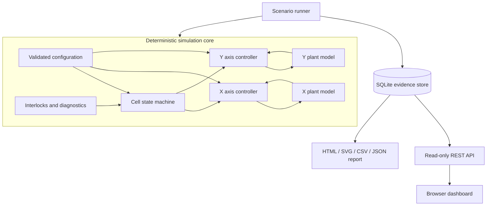

# Architecture

## Design goals

The architecture makes control behavior inspectable, failures reproducible, and future integrations replaceable. It intentionally avoids a single large machine class that mixes dynamics, sequencing, database operations, and web requests.

## Package boundaries

| Package | Responsibility | Must not do |
| --- | --- | --- |
| `control` | feedback controller behavior | persistence, web, or machine sequencing |
| `motion` | drive state, profile, plant, axis diagnostics | database writes or HTTP calls |
| `cell` | interlocks and automatic sequence | own plant integration or SQL |
| `simulation` | cyclic orchestration and fault scenarios | hide nondeterministic network dependencies |
| `manufacturing` | schema, traceability, events, OEE | command axes |
| `reporting` | portable evidence outputs | alter simulation state |
| `api` / `web` | read-only presentation | issue motion commands |

## Cyclic execution

At every simulated cycle:

1. read interlock and drive conditions
2. update machine state using prior-cycle axis status
3. set validated axis targets
4. inject a scheduled scenario when applicable
5. execute motion profile, PID, and plant steps
6. evaluate axis and permission diagnostics
7. sample telemetry at the configured interval
8. record state transitions, cycles, and faults

The current runner advances simulated time; it does not claim wall-clock deadlines. A future real-time adapter must preserve the same command/status boundaries and add timing evidence.

## Dependency direction

Core modules depend inward on small data objects. SQLite, FastAPI, HTML, Docker, and future industrial protocols sit outside the motion loop. This keeps tests fast and allows external adapters to change without rewriting control behavior.

## Data ownership

- configuration owns limits, tuning, points, dwell, and ideal cycle time
- the state machine owns current sequence state and active part ID
- each axis owns plant, drive, profile, controller, target, and diagnostics
- the telemetry store owns durable run evidence
- the report and API read evidence after or during a run but do not command it
