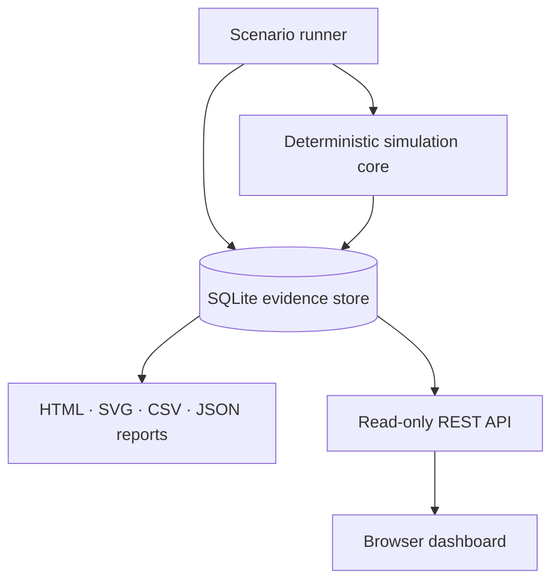
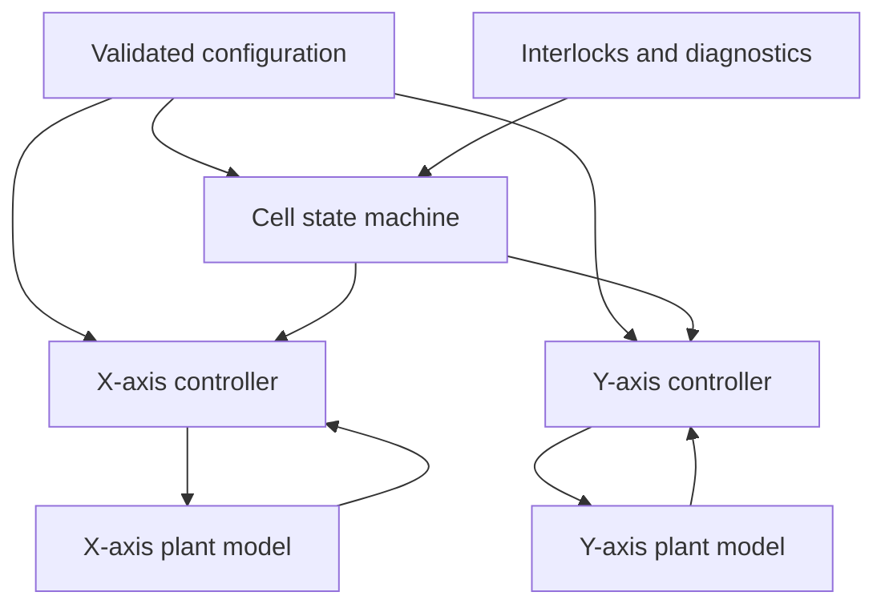
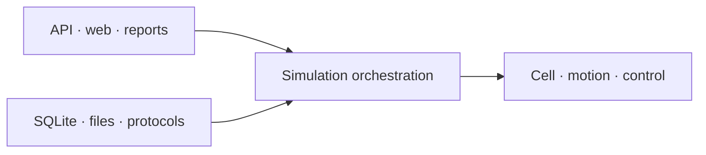

# Architecture

## Design goals

The architecture is designed to make control behavior inspectable, failures
reproducible, and external integrations replaceable.

It deliberately avoids a single machine class that combines motion dynamics,
sequence control, persistence, reporting, and network requests.

The main design principles are:

* deterministic execution inside the simulation loop
* explicit ownership of machine and axis state
* inward-facing dependencies for core control modules
* replaceable infrastructure and presentation adapters
* durable evidence that can be inspected without changing machine state

## System overview

The scenario runner advances simulated time, executes configured scenarios, and
records evidence. Reporting and presentation components consume stored evidence
but do not issue motion commands.

## Deterministic simulation core

The state machine coordinates cell-level behavior using validated configuration,
interlock status, and prior-cycle axis status.

Each axis owns its controller, profile, drive state, plant model, target, and
diagnostics. Axis feedback remains inside the deterministic simulation loop.

## Package boundaries

| Package         | Responsibility                                            | Must not do                                                       |
| --------------- | --------------------------------------------------------- | ----------------------------------------------------------------- |
| `control`       | Feedback-controller behavior                              | Persist data, serve web requests, or coordinate machine sequences |
| `motion`        | Drive state, profiles, plant models, and axis diagnostics | Write to databases or make HTTP requests                          |
| `cell`          | Interlocks and automatic sequence behavior                | Own plant integration or execute SQL                              |
| `simulation`    | Cyclic orchestration and deterministic fault scenarios    | Introduce hidden network or wall-clock dependencies               |
| `manufacturing` | Schema, traceability, events, cycles, and OEE             | Command motion axes                                               |
| `reporting`     | Portable evidence outputs                                 | Alter simulation or machine state                                 |
| `api` / `web`   | Read-only presentation of recorded evidence               | Issue motion commands                                             |

## Cyclic execution

During every simulated cycle, the runner performs the following operations in a
defined order:

1. Read interlock, permission, and drive conditions.
2. Update the machine state using prior-cycle axis status.
3. Set validated axis targets.
4. Apply a scheduled scenario or fault when applicable.
5. Execute motion-profile, PID-controller, and plant-model steps.
6. Evaluate axis, following-error, and permission diagnostics.
7. Sample telemetry at the configured interval.
8. Record state transitions, completed cycles, and detected faults.

This ordering is part of the simulation contract. Changes to the cycle sequence
must be deliberate, documented, and covered by deterministic tests.

## Time model

The current runner advances simulated time. It does not claim wall-clock
deadlines, hard real-time behavior, or deterministic execution timing on a
general-purpose operating system.

A future real-time adapter must preserve the existing command and status
boundaries while adding explicit timing evidence, including:

* requested cycle period
* observed cycle duration
* deadline misses
* scheduling jitter
* command and feedback timestamps

## Dependency direction

Core modules depend inward on small data objects and explicit interfaces.

Infrastructure and presentation technologies remain outside the motion loop,
including:

* SQLite
* FastAPI
* HTML and browser assets
* Docker
* reporting formats
* future industrial protocols

This dependency direction keeps control tests fast and allows adapters to change
without rewriting machine or motion behavior.

Dependencies point toward the deterministic control model. Domain modules do
not import presentation or infrastructure implementations.

## Data ownership

### Configuration

Configuration owns:

* travel limits
* velocity and acceleration limits
* controller tuning
* machine points
* dwell durations
* ideal cycle time
* telemetry sampling intervals

Configuration is validated before a run begins.

### Cell state machine

The state machine owns:

* the current sequence state
* the active part identifier
* sequence transitions
* cell-level fault and recovery decisions
* requests sent to each axis

### Motion axes

Each axis owns:

* plant state
* drive state
* active motion profile
* controller state
* requested target
* measured position and velocity
* following-error and motion diagnostics

### Evidence store

The telemetry store owns durable run evidence, including:

* sampled telemetry
* state transitions
* cycle records
* fault records
* traceability data
* scenario metadata
* run configuration and provenance

### Reporting and presentation

Reports, the REST API, and the browser dashboard read stored evidence during or
after a run.

They do not own simulation state and cannot issue motion commands.

## Safety and control boundary

The API and browser dashboard are intentionally read-only. This preserves a
clear boundary between deterministic simulation behavior and external
presentation technologies.

The architecture is a simulation and software-design demonstrator. It is not a
certified safety controller, hard real-time control system, or interface for
operating physical machinery.
