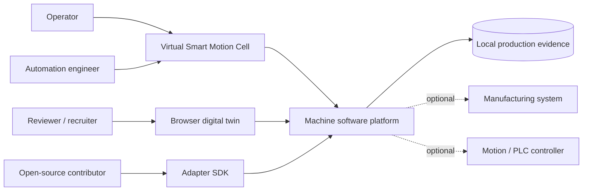

# C4 level 1 — System context

The software platform owns machine sequencing, command validation, simulated motion, alarms, recovery, traceability, and state publication. External controllers and manufacturing systems are optional adapters.
