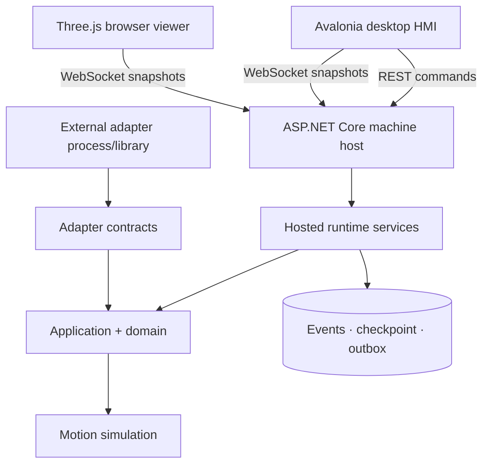

# C4 level 2 — Container view

The API and runtime share one process for a single virtual machine. The HMI and browser remain independent processes. This is a deliberate modular-monolith decision, not an unfinished microservice migration.
