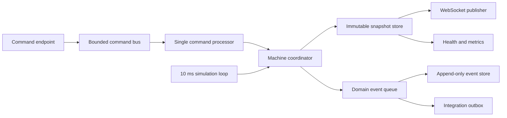

# C4 level 3 — Runtime components

The coordinator is the only component allowed to mutate machine state. The command processor and simulation loop may run on different hosted tasks, but coordinator operations are serialized by its state lock.
