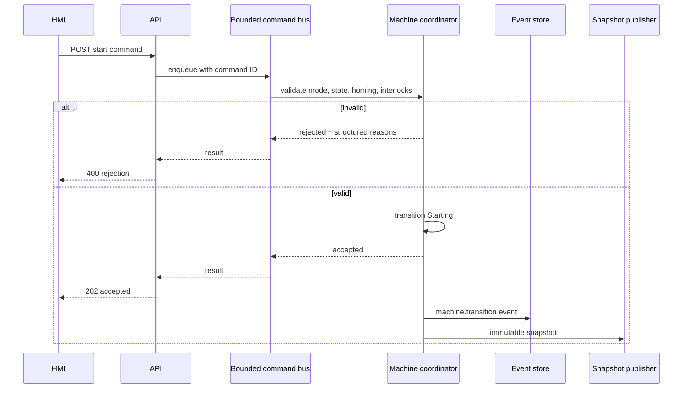

# Dynamic view — command processing

```mermaid
sequenceDiagram
    participant H as HMI
    participant A as API
    participant B as Bounded command bus
    participant C as Machine coordinator
    participant E as Event store
    participant S as Snapshot publisher

    H->>A: POST start command
    A->>B: enqueue with command ID
    B->>C: validate mode, state, homing, interlocks
    alt invalid
      C-->>B: rejected + structured reasons
      B-->>A: result
      A-->>H: 400 rejection
    else valid
      C->>C: transition Starting
      C-->>B: accepted
      B-->>A: result
      A-->>H: 202 accepted
      C->>E: machine.transition event
      C->>S: immutable snapshot
    end
```
