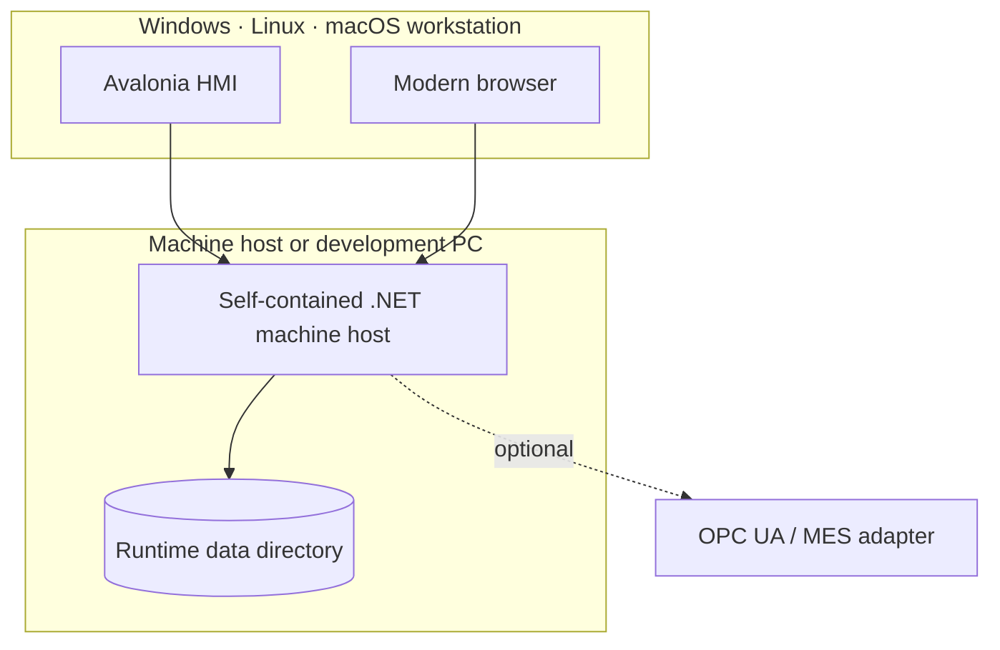

# Deployment view

```mermaid
flowchart TB
    subgraph Desktop[Windows · Linux · macOS workstation]
      HMI[Avalonia HMI]
      Browser[Modern browser]
    end
    subgraph Host[Machine host or development PC]
      API[Self-contained .NET machine host]
      Data[(Runtime data directory)]
      API --> Data
    end
    HMI --> API
    Browser --> API
    API -. optional .-> External[OPC UA / MES adapter]
```

The machine host can run as a console process, systemd service, Windows service wrapper, launch daemon, or Linux container. Release automation produces RID-specific packages.
