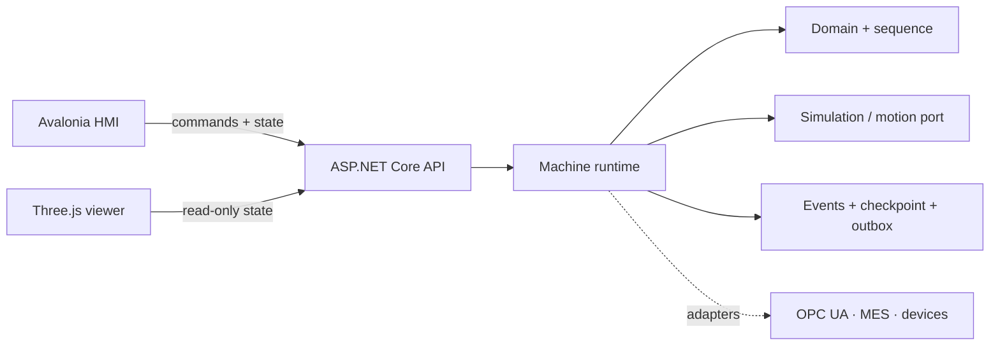

# Architecture overview

The project uses a modular monolith for the machine runtime and independent client processes for the HMI and browser viewer. The architecture favors deterministic ownership, testability, and failure isolation over unnecessary microservices.

## Architectural rules

1. The domain cannot reference UI, networking, storage, or vendor packages.
2. Commands are serialized through a bounded queue.
3. Only the machine coordinator owns mutable machine state.
4. Clients receive immutable snapshots and do not calculate authoritative state.
5. Visualization failure must not stop machine execution.
6. Motion commands are not automatically retried.
7. Restart never resumes physical assumptions automatically; it enters recovery.
8. Integration delivery is idempotent and separate from the control loop.
9. Platform-specific code is isolated behind adapters.
10. Architecture changes are recorded as ADRs.
