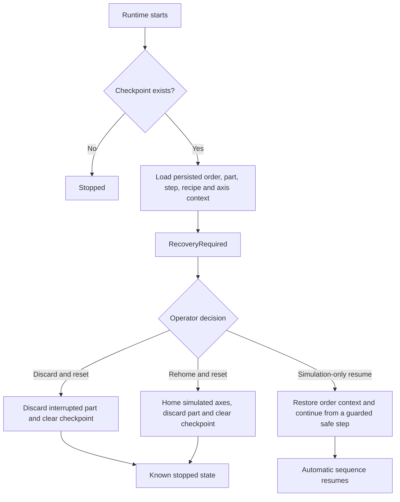

# Restart and recovery design

Unexpected restart is treated as a state-reconciliation problem, not as a normal resume.

## Persisted checkpoint

The checkpoint includes:

- machine revision and timestamp
- machine mode, execution state and production step
- active order and quantity progress
- active part identifier
- active recipe and revision
- gripper state
- X/Y actual and target positions
- cycle start time
- recovery reason

The runtime refreshes the checkpoint periodically while production is active and on significant transitions. Writes use atomic replacement and are serialized so a timer write cannot race a transition write.

## Startup behavior

When a checkpoint is found, the runtime enters `RecoveryRequired`. It does not issue motion automatically. Operator commands other than recovery, reset and diagnostics are rejected with structured reasons.

## Recovery choices

| Choice | Intended use | Behavior |
|---|---|---|
| Discard and reset | Safest generic option | Marks the interrupted part as discarded, clears production context and returns to a known stopped state |
| Rehome and reset | Position confidence is lost | Homes the simulated motion system before clearing the interrupted cycle |
| Simulation-only resume | Demonstration and test scenarios | Restores the persisted order and resumes only through guarded simulator logic; it is explicitly not a recommendation for physical machinery |

Every recovery decision is recorded as a traceability event with the command correlation ID.

## Safety boundary

This repository is a software architecture and virtual-commissioning reference. It is not a certified safety system. A physical-machine implementation must reconcile real sensors, actuators and safe positions before enabling motion, and should normally prefer discard/reset or a validated machine-specific recovery procedure.
