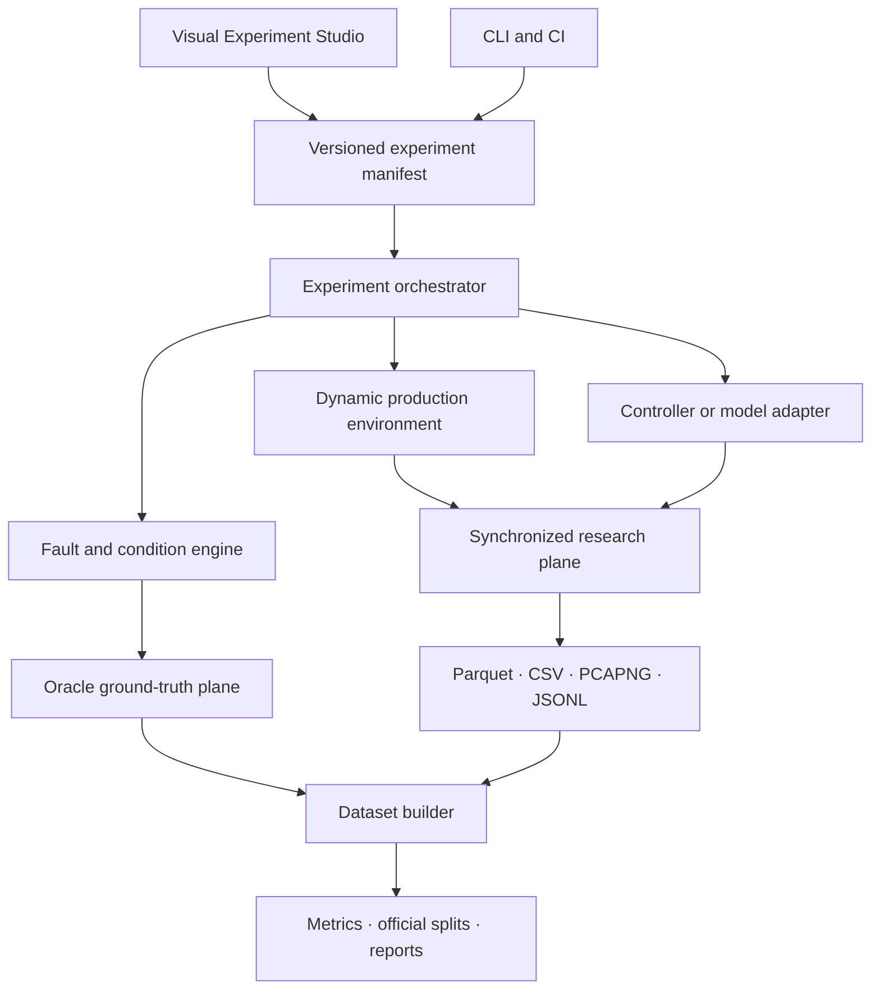

# Final research plan

## Research identity

**Virtual Smart Motion Cell Research Bench** is a visual, reproducible, machine-fault-first cyber-physical production benchmark. It is intended for equipment diagnostics, predictive maintenance, multimodal anomaly detection, resilient automation software, and model-in-the-loop evaluation.

The priority order is:

1. machine faults;
2. dynamic production operation;
3. synchronized multimodal data;
4. AI/ML benchmarking and deployment;
5. network-fault discrimination;
6. controlled cyber-influenced scenarios;
7. optional honeypot and deception research.

This ordering prevents the project from becoming a collection of unrelated security, simulation, and analytics features.

## System concept

## Release sequence

### Phase R0 — Research foundation — implemented

- `VSMC-DynamicGantry-v1` environment;
- accelerated and wall-clock execution selection;
- deterministic seeded execution;
- changing products, payloads, orders, queues, and changeovers;
- planned maintenance events;
- machine and network scenario taxonomy;
- observable and ground-truth separation;
- EtherCAT PCAPNG plus Parquet, CSV, and JSONL bundle generation;
- visual guided experiment creation;
- multimodal fixed-window dataset view.

### Phase R0.5 — EtherCAT protocol foundation — implemented

- Ethernet EtherType `0x88A4`;
- EtherCAT command-frame headers and LRW datagrams;
- logical process image at `0x00001000`;
- two-axis CiA 402-style cyclic synchronous position PDO mapping;
- outgoing and returned cycle capture;
- Working Counter validity;
- missing, delayed, duplicated, and counter-invalid cycle effects;
- decoded packet, exchange, PDO, and flow tables;
- offline-only execution with no raw network transmission.

This phase improves protocol realism while explicitly stopping short of ETG conformance, hardware commissioning, Distributed Clocks, mailbox services, or a full MainDevice implementation.

### Phase R1 — Dynamic machine-fault benchmark

Complete and validate the machine-fault library:

- mechanical: friction, backlash, misalignment, stiffness reduction, obstruction, transmission slip;
- sensor: drift, noise, bias, dropout, freeze, delay, scaling error;
- drive: derating, saturation, intermittent availability, stuck actuator;
- motion control: poor tuning, incorrect homing, limit errors, synchronization loss;
- process/tooling: failed pick, dropped part, gripper malfunction, inspection degradation;
- software/sequence: stale commands, duplicated commands, timeouts, checkpoint corruption.

Required progression models:

- abrupt;
- intermittent;
- gradual;
- periodic;
- state-dependent;
- load-dependent;
- cascading;
- permanent until maintenance;
- self-clearing transient.

### Phase R2 — Dataset and synchronization maturity

- stable schema registry;
- source-specific sequence-gap detection;
- clock offset/drift quality model;
- event-centered and cycle-centered dataset views;
- EtherCAT packet, LRW exchange, Working Counter, and decoded PDO extension tables;
- .NET/Python Parquet conformance fixtures;
- dataset cards, checksums, and immutable releases;
- official train, validation, IID, and OOD splits.

### Phase R3 — Baseline models and model-in-the-loop testing

- threshold and statistical process control baselines;
- isolation forest and tree-based fault classifiers;
- temporal autoencoder and sequence-model baselines;
- component localization and severity estimation;
- ONNX shadow deployment;
- replay, advisory, and simulation-only closed-loop modes;
- inference latency, deadline, CPU, memory, and fallback metrics.

### Phase R4 — Additional environments

- `VSMC-CoupledAxes-v1`;
- `VSMC-ConveyorTracking-v1`;
- `VSMC-MultiStationLine-v1`;
- `VSMC-NetworkedCell-v1`;
- `VSMC-QualityInspection-v1`.

Each environment must implement the same reset/step/describe/complete contract and declare compatible observation, action, fault, and data schemas.

### Phase R5 — Controlled cyber-physical resilience

Add effect-level scenarios against synthetic services only:

- message delay, loss, duplication, and reordering;
- stale telemetry;
- synthetic command replay;
- parameter and recipe manipulation effects;
- loss of view or control;
- alarm-notification suppression effect;
- service disruption.

No external targeting, arbitrary exploit execution, or real machine control is part of the public benchmark.

### Phase R6 — Optional honeypot research

- controlled deception benchmark;
- private institutional cyber-range adapter;
- public low-interaction decoy profile;
- constrained interaction-to-effect translation;
- graded label confidence and analyst annotations;
- privacy, ethics, legal, and retention controls.

### Phase R7 — Publication artifacts

- frozen benchmark and schema versions;
- reference runs on supported platforms;
- containerized one-command reproduction;
- raw and processed data bundles;
- expected tables and figures;
- permanent archive and DOI;
- external artifact reproduction report.

## Release gates

A phase is complete only when it includes:

1. implemented source code;
2. executable tests;
3. versioned manifests and schemas;
4. reference outputs;
5. documentation and limitations;
6. contributor extension guidance;
7. reproducibility evidence from a clean environment.

## Scope boundary

The platform is a simulation, data, and equipment-software research artifact. It does not claim certified safety, high-fidelity machine physics, or direct validity for a production machine without external validation.
