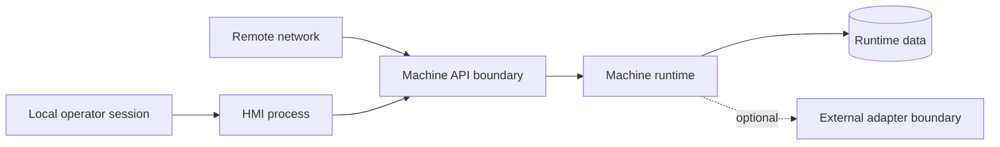

# Threat model

## Assets

- command authority
- machine state and alarm integrity
- recipe and configuration integrity
- traceability records
- release artifacts and contributor trust

## Trust boundaries

## Primary threats and controls

| Threat | Baseline control |
|---|---|
| Unauthorized command | Remote commands disabled; future authenticated roles |
| Command flood | Bounded command queue and explicit rejection |
| Unsafe automatic retry | Motion commands are never automatically retried |
| Path/configuration tampering | Validated configuration and dedicated data directory |
| Stale client state | Complete revisioned snapshots and reconnect replacement |
| Duplicate manufacturing result | Event ID used as idempotency key |
| Dependency compromise | Dependabot, dependency review, CodeQL, Scorecard, SBOM |
| Malicious contribution | Required reviews and CODEOWNERS after publishing |
| Misuse with physical equipment | Explicit simulation-only boundary and adapter defaults |

The project is informed by industrial cybersecurity principles but does not claim ISA/IEC 62443 compliance or certification.
